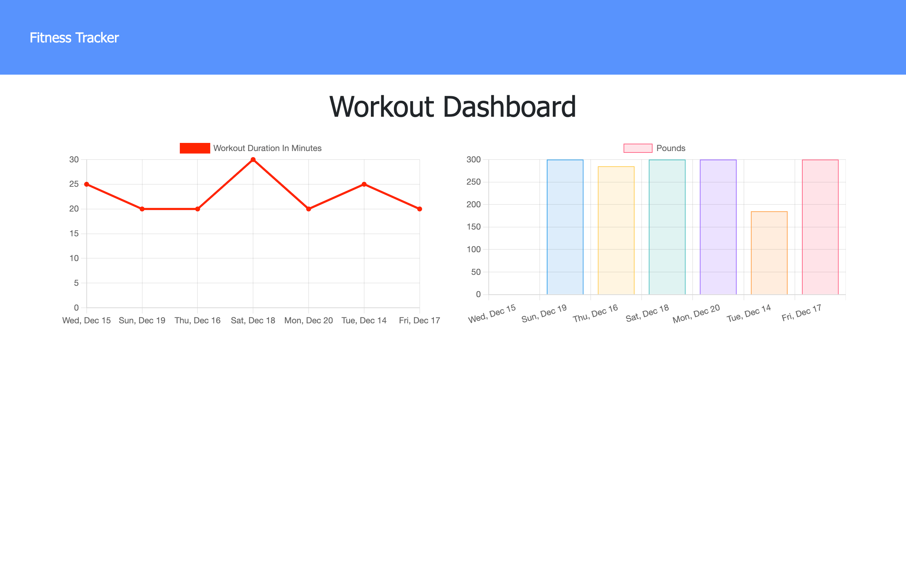

# **Workout Wonders**

## Description

Workout Wonders is a web application that allows users to create and track daily workouts, log multiple exercieses as well as view their progress in a color coded stats page.

## License

This project is licensed by: MIT

## Table of Contents

- [Installation](#installation)
- [Usage](#usage)
- [Project Screenshots](#screenshots)
- [Technology](#technology)
- [Contact](#contact)

## Installation

- Client-Side

  1. Click the [heroku link](https://workout-wonders.herokuapp.com/) to be taken to the web application.

- Locally:
  1. Download this repository
  2. Go to location of the repository and open a terminal
  3. run `npm i` ...
  4. ... then run `npm start`
  5. Open browser and type http://localhost:3001/ (if you happen to have something already running on that port, the server will automatically jump to the next available port)

## Usage

Start by either creating a new workout or updating your current one. Next, choose whether your exercise will be resistance based or cardio based. Finally enter the metrics of your workout. You have the option to add as many exercises as you like. When you're finished press the "complete" button to create your workout.

## Screenshots

## Technology

- express.js
- mongo.js
- mongoose
- morgan

## Contact

For questions or any other inqurires please contact me at amellis245@gmail.com
or on [Github](https://www.github.com/aellis07).
